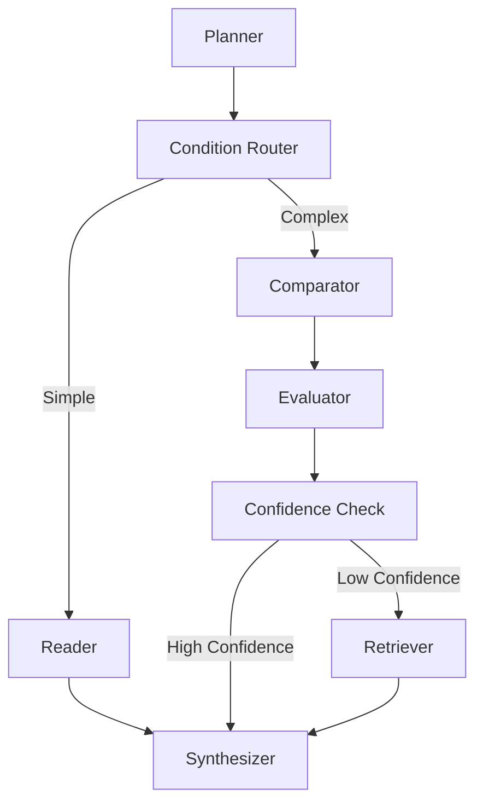

# ResearchAssist

ResearchAssist is a prototype AI agent designed to ingest PDF research papers and provide powerful insights through specialized AI roles. Inspired by NotebookLM, it supports multiple active PDF uploads and features a dynamic LangGraph workflow that intelligently routes between processing paths based on task complexity and the number of uploaded documents.

## Key Features

- **Multi-Paper Ingestion**: Upload one or multiple PDF research papers simultaneously.
- **Conditional LangGraph Workflow**: A dynamic graph architecture handles the routing logic:
  - **Planner**: Maps out an extraction strategy based on the documents.
  - **Reader / Comparator**: Reads individual papers or compares multiple papers for similarities and contrasts.
  - **Evaluator**: Analyzes reliability, strengths, and weaknesses of arguments.
  - **Confidence Router**: Performs specialized checks and decides if further external retrieval is needed.
  - **Retriever / Synthesizer**: Generates the final, comprehensive report and user dashboard.
- **FastAPI Backend**: A robust and asynchronous Python backend powered by FastAPI, Langchain, and Groq.
- **React + Vite Frontend**: A modern, sleek user interface built with ReactJS for seamless interaction.

## Architecture

The AI agent's logic is structured as a complex state graph to handle a variety of condition-based analysis tasks:



## Prerequisites

- **Node.js** (v18+ recommended)
- **Python** (3.9+)
- **Groq LLM**: LLM inference is powered by `langchain-groq`.

## Getting Started

### 1. Project Setup
Set up your environment variables based on the template:

```bash
# In the root directory, configure your Groq API key in the .env file
echo "GROQ_API_KEY=YOUR_API_KEY_HERE" > .env
```

### 2. Backend Setup
Set up a Python virtual environment and install backend dependencies:

```bash
# From the root directory
python -m venv .venv

# Activate the virtual environment
# On Windows:
.venv\Scripts\activate
# On macOS/Linux:
source .venv/bin/activate

# Install requirements
pip install -r backend/requirements.txt

# Start the FastAPI server
uvicorn backend.main:app --reload
```
The FastAPI backend will start on `http://127.0.0.1:8000`.

### 3. Frontend Setup
Open a new terminal, navigate to the frontend directory, and start the development server:

```bash
cd frontend
npm install
npm run dev
```
The React development server will start, typically accessible at `http://localhost:5173`.

## Technologies

- **Frontend**: ReactJS 19, Vite, Lucide Icons, Axios, React Markdown.
- **Backend**: FastAPI, Uvicorn, Python Multipart, PyPDF.
- **AI Engine**: LangGraph, Langchain, Langchain Groq SDK.
