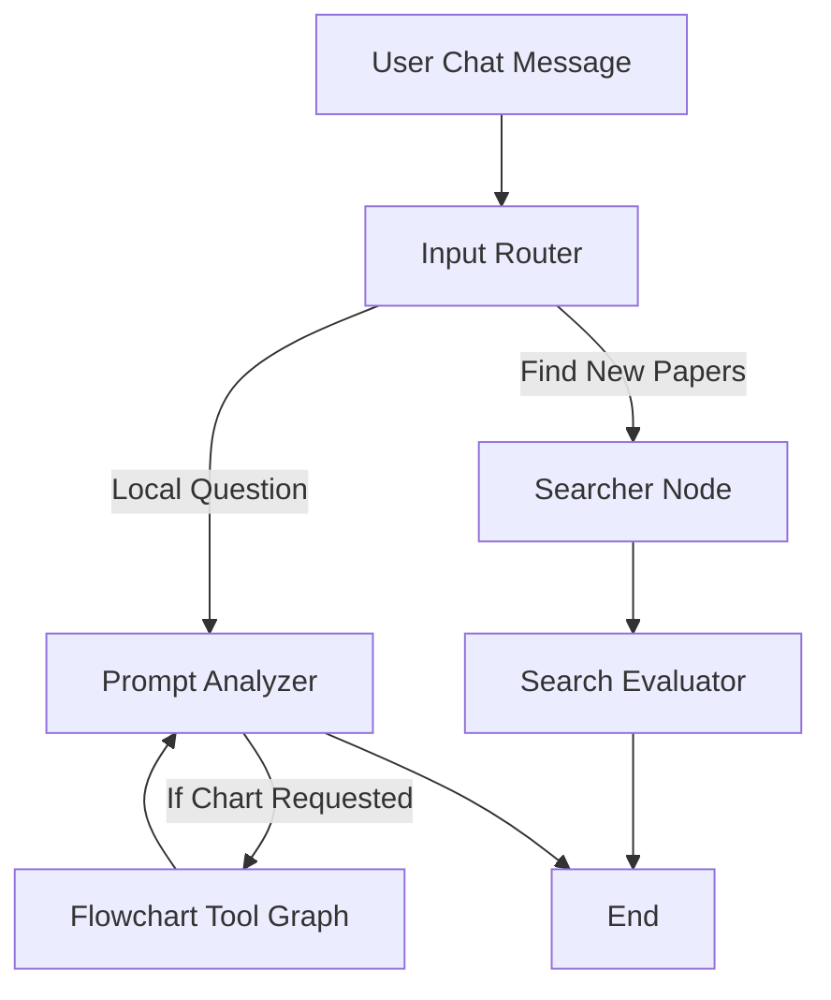
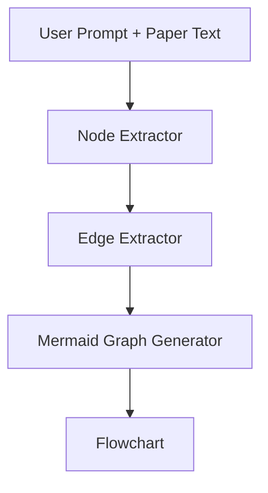

# ResearchAssist

ResearchAssist is a prototype AI agent designed to ingest PDF research papers and provide powerful insights through specialized AI roles. Inspired by NotebookLM, it supports multiple active PDF uploads and features a dynamic LangGraph workflow that intelligently routes between processing paths based on task complexity and the number of uploaded documents.

## Key Features

- **Real-Time RAG (Retrieval-Augmented Generation)**: Upload one or multiple PDF research papers which are instantly ingested into a Pinecone Vector Database. Chat synchronously the moment files are dropped.
- **Dynamic LangGraph Workflow**: A smart routing architecture designed to streamline queries seamlessly:
  - **Prompt Analyzer**: Serves as your chatbot, utilizing vector retrieval and context to answer questions on existing papers.
  - **Searcher Agent**: Connects live to Google Scholar (via SerpAPI) to pull parameters and scan external databases on demand.
  - **Search Evaluator**: Critiques the clarity and reliability of incoming Google Scholar snippets prior to UI rendering.
  - **Flowchart Agent**: An internal MCP-like sub-agent triggering dynamically when users request visual diagrams.
- **FastAPI Backend**: A robust and asynchronous Python backend powered by FastAPI, Langchain, and Groq.
- **React + Vite Frontend**: A modern, sleek chat-centric interface built with ReactJS to facilitate interactive dropzones.

## Architecture

The AI agent's logic leverages a hyper-optimized state graph specifically tuned for instantaneous conversational responses and external API orchestration:



Also, our Agent has a MCP tool to generate flowcharts seamlessly from the paper.



## Prerequisites

- **Node.js** (v18+ recommended)
- **Python** (3.9+)
- **Groq LLM**: LLM inference is powered by `langchain-groq`.
- **Pinecone**: Standard vector similarity engine.
- **SerpAPI**: Real-time Google Scholar web integration.

## Getting Started

### 1. Project Setup
Set up your environment variables based on the template:

```bash
# In the root directory, configure your API keys in the .env file
echo "GROQ_API_KEY=YOUR_GROQ_KEY
PINECONE_API_KEY=YOUR_PINECONE_KEY
PINECONE_INDEX_NAME=researchassist-index
SERPAPI_API_KEY=YOUR_SERPAPI_KEY" > .env
```

### 2. Backend Setup
Set up a Python virtual environment and install backend dependencies:

```bash
# From the root directory
python -m venv .venv

# Activate the virtual environment
# On Windows:
.venv\Scripts\activate
# On macOS/Linux:
source .venv/bin/activate

# Install requirements
pip install -r backend/requirements.txt

# Start the FastAPI server
uvicorn backend.main:app --reload
```
The FastAPI backend will start on `http://127.0.0.1:8000`.

### 3. Frontend Setup
Open a new terminal, navigate to the frontend directory, and start the development server:

```bash
cd frontend
npm install
npm run dev
```
The React development server will start, typically accessible at `http://localhost:5173`.

## Technologies

- **Frontend**: ReactJS 19, Vite, Lucide Icons, Axios, React Markdown.
- **Backend**: FastAPI, Uvicorn, Python Multipart, PyPDF.
- **AI Engine**: LangGraph, Langchain, Langchain Groq SDK.
