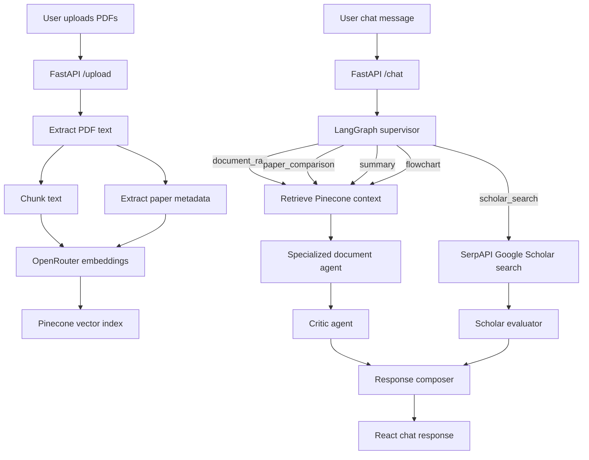
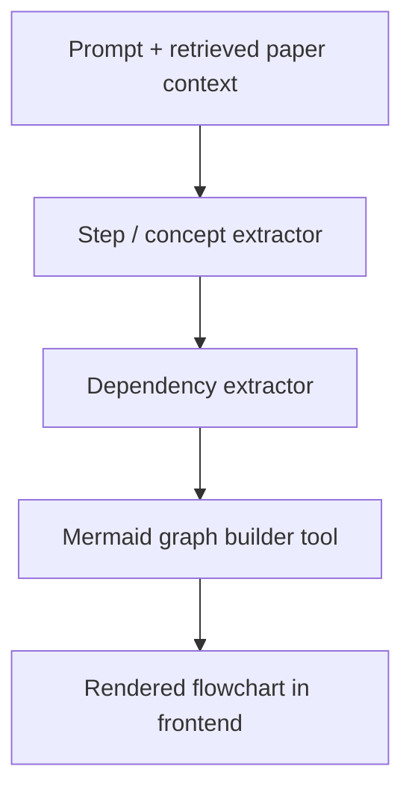

# ResearchAssist

ResearchAssist is a prototype AI research assistant for reading PDF papers, indexing their content, and answering research questions through a small multi-agent workflow. It combines a FastAPI backend, Pinecone vector search, LangGraph orchestration, OpenRouter-compatible LLM calls, Google Scholar search through SerpAPI, and a React + Vite chat UI.

The project is useful as a fresher/junior AI engineer portfolio piece because it demonstrates document ingestion, RAG, routing, tool use, model configuration, Docker deployment, and a frontend that exposes agent traces.

## Features

- **PDF ingestion and chunking**: Users upload one or more PDFs. The backend extracts text with `pypdf`, splits it into overlapping chunks, extracts basic paper metadata with an LLM, and stores the chunks in Pinecone.
- **User-scoped RAG**: Retrieval filters by `user_id` so each browser guest account gets its own document and chat memory context.
- **LangGraph multi-agent workflow**: A supervisor routes each request to one of several paths:
  - **Document RAG Agent**: Answers questions using uploaded document context and chat history.
  - **Paper Comparison Agent**: Compares retrieved paper sections across problem, method, findings, limitations, and implications.
  - **Summary Agent**: Produces concise research summaries from retrieved context.
  - **Flowchart Agent**: Builds Mermaid diagrams from paper context through a nested graph.
  - **Scholar Search Agent**: Searches Google Scholar through SerpAPI for external paper discovery.
  - **Critic / Evaluator Agents**: Add lightweight grounding, relevance, and clarity checks before the final response.
- **OpenRouter model gateway**: Uses `langchain-openai` against OpenRouter-compatible chat and embedding APIs.
- **Optional local chat model**: The chat LLM can be switched to an OpenAI-compatible local server such as Soup, Ollama, LM Studio, or vLLM. Embeddings still use OpenRouter in the current code.
- **Fine-tuning assets**: Includes a starter SFT dataset, Soup config, and notebook for experimenting with a small local research-assistant model.
- **React chat UI**: Supports drag-and-drop PDF upload, chat, model status display, active-agent traces, Markdown, and Mermaid rendering.
- **Docker Compose deployment**: Runs the backend and production frontend together, with an optional Cloudflare Tunnel profile.

## Architecture


```mermaid
graph TD
    A[User uploads PDFs] --> B[FastAPI /upload]
    B --> C[Extract PDF text]
    C --> D[Chunk text]
    C --> E[Extract paper metadata]
    D --> F[OpenRouter embeddings]
    E --> F
    F --> G[Pinecone vector index]

    H[User chat message] --> I[FastAPI /chat]
    I --> J[LangGraph supervisor]
    J -->|document_rag| K[Retrieve Pinecone context]
    J -->|paper_comparison| K
    J -->|summary| K
    J -->|flowchart| K
    J -->|scholar_search| L[SerpAPI Google Scholar search]
    K --> M[Specialized document agent]
    M --> N[Critic agent]
    L --> O[Scholar evaluator]
    N --> P[Response composer]
    O --> P
    P --> Q[React chat response]
```

Flowchart requests use a nested LangGraph workflow:


```mermaid
graph TD
    A[Prompt + retrieved paper context] --> B[Step / concept extractor]
    B --> C[Dependency extractor]
    C --> D[Mermaid graph builder tool]
    D --> E[Rendered flowchart in frontend]
```

## Prerequisites

- Node.js 18+ for the frontend.
- Python 3.12 recommended for the backend Docker image. Local development should also work on modern Python 3 versions supported by the listed dependencies.
- OpenRouter API key for chat models and embeddings.
- Pinecone API key for vector storage.
- SerpAPI key for Google Scholar search.
- Optional: an OpenAI-compatible local chat model server.
- Optional: Cloudflare Tunnel token for public deployment.

## Environment Variables

Create a local `.env` file from the included template:

```bash
cp .env.example .env
```

Then fill in the required values:

```env
LLM_PROVIDER=openrouter

OPENROUTER_API_KEY=YOUR_OPENROUTER_KEY
OPENROUTER_DEFAULT_MODEL=openai/gpt-4o-mini
OPENROUTER_FAST_MODEL=openai/gpt-4o-mini
OPENROUTER_REASONING_MODEL=openai/gpt-4o
OPENROUTER_STRUCTURED_MODEL=openai/gpt-4o-mini
OPENROUTER_EMBEDDING_MODEL=openai/text-embedding-3-small
OPENROUTER_EMBEDDING_DIMENSIONS=384

PINECONE_API_KEY=YOUR_PINECONE_KEY
PINECONE_INDEX_NAME=researchassist-index

SERPAPI_API_KEY=YOUR_SERPAPI_KEY
```

For a local chat model, set:

```env
LLM_PROVIDER=local
LOCAL_LLM_BASE_URL=http://127.0.0.1:8001/v1
LOCAL_LLM_MODEL=researchassist-soup
LOCAL_LLM_API_KEY=local-not-needed
```

When the backend runs inside Docker Compose and the local model runs on your host machine, use:

```env
LOCAL_LLM_BASE_URL=http://host.docker.internal:8001/v1
```

## Local Development

### Backend

```bash
python -m venv .venv
source .venv/bin/activate
pip install -r backend/requirements.txt
uvicorn backend.main:app --reload
```

On Windows PowerShell:

```powershell
python -m venv .venv
.venv\Scripts\Activate.ps1
pip install -r backend/requirements.txt
uvicorn backend.main:app --reload
```

The backend runs at `http://127.0.0.1:8000`.

Useful endpoints:

- `GET /` - health check.
- `GET /model` - returns non-secret model runtime settings and local-model connection status.
- `POST /upload` - accepts one or more PDF files plus `user_id`.
- `POST /chat` - accepts `user_prompt`, `chat_history`, `user_id`, and `session_id`.

### Frontend

```bash
cd frontend
npm install
npm run dev
```

The Vite dev server usually runs at `http://localhost:5173`.

The frontend calls API routes through `/api/*`. In production Docker, Nginx proxies those requests to the backend. For local Vite development, add a Vite proxy if your local setup does not already route `/api` to `http://127.0.0.1:8000`.

## Docker

Build and run the app:

```bash
docker compose up --build
```

The production frontend is served at `http://localhost:8080`, and Nginx proxies `/api/*` requests to the FastAPI backend container.

To run with Cloudflare Tunnel, create a tunnel in Cloudflare Zero Trust, configure the public hostname service to `http://frontend:80`, add the generated token to `.env`, then start:

```bash
docker compose --profile tunnel up --build -d
```

## Optional Local Fine-Tuning Workflow

This repo includes a Soup-based experiment for a small local research-assistant model:

```bash
jupyter lab notebooks/soup_finetune_local_model.ipynb
```

Related files:

- `data/finetune/researchassist_sft_sample.jsonl` - starter Alpaca-style SFT examples.
- `notebooks/soup_researchassist.yaml` - Soup training config.
- `models/researchassist-soup` - expected local output folder after training.

After training, serve the model with Soup:

```bash
soup serve --model ./models/researchassist-soup --host 127.0.0.1 --port 8001
```

Then switch `LLM_PROVIDER=local` in `.env`.

## Tech Stack

- **Frontend**: React 19, Vite, Axios, Lucide React, React Markdown, Mermaid.
- **Backend**: FastAPI, Uvicorn, Pydantic, PyPDF, LangChain, LangGraph.
- **AI / Retrieval**: OpenRouter-compatible chat models, OpenRouter embeddings, Pinecone, SerpAPI Google Scholar.
- **Deployment**: Docker, Docker Compose, Nginx, optional Cloudflare Tunnel.

## Known Limitations

- Embeddings always use OpenRouter in the current implementation, even when chat generation uses a local model.
- The local Vite dev server may need a proxy for `/api/*` calls, depending on how you run the frontend.
- PDF extraction quality depends on `pypdf`; scanned PDFs need OCR before this pipeline can read them.
- The Scholar search path returns snippets and links, not full-paper content.
- The project is a prototype and does not yet include authentication, persistent user accounts, automated tests, or production-grade error handling.
