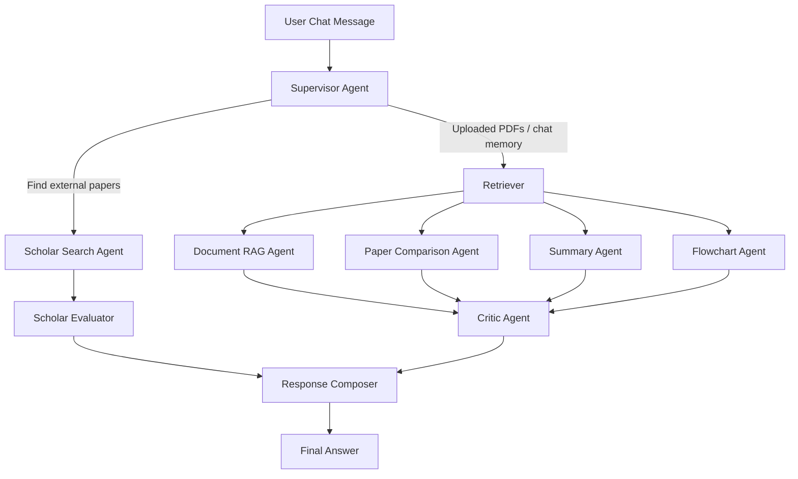
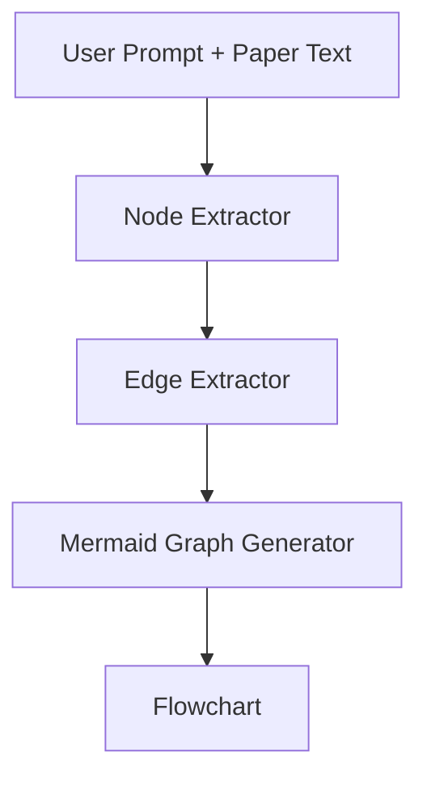

# ResearchAssist

ResearchAssist is a prototype AI agent designed to ingest PDF research papers and provide powerful insights through specialized AI roles. Inspired by NotebookLM, it supports multiple active PDF uploads and features a dynamic LangGraph workflow that intelligently routes between processing paths based on task complexity and the number of uploaded documents.

## Key Features

- **Real-Time RAG (Retrieval-Augmented Generation)**: Upload one or multiple PDF research papers which are instantly ingested into a Pinecone Vector Database. Chat synchronously the moment files are dropped.
- **Dynamic LangGraph Multi-Agent Workflow**: A supervisor routes requests through specialized agents:
  - **Document RAG Agent**: Retrieves user-scoped PDF and chat memory context from Pinecone.
  - **Scholar Search Agent**: Connects live to Google Scholar via SerpAPI for external paper discovery.
  - **Paper Comparison Agent**: Compares papers across methods, findings, limitations, and implications.
  - **Summary Agent**: Produces research-focused summaries from retrieved paper context.
  - **Flowchart Agent**: Generates Mermaid diagrams through a dedicated extraction subgraph.
  - **Critic Agent**: Checks grounding, clarity, and overclaiming before final composition.
- **OpenRouter Model Gateway**: Uses OpenRouter-compatible chat models through `langchain-openai`.
- **FastAPI Backend**: A robust and asynchronous Python backend powered by FastAPI, LangChain, and LangGraph.
- **React + Vite Frontend**: A modern, sleek chat-centric interface built with ReactJS to facilitate interactive dropzones.

## Architecture

The AI agent's logic leverages a hyper-optimized state graph specifically tuned for instantaneous conversational responses and external API orchestration:


```mermaid
graph TD
    A[User Chat Message] --> B[Supervisor Agent]
    B -->|Uploaded PDFs / chat memory| C[Retriever]
    C --> D[Document RAG Agent]
    C --> E[Paper Comparison Agent]
    C --> F[Summary Agent]
    C --> G[Flowchart Agent]
    B -->|Find external papers| H[Scholar Search Agent]
    H --> I[Scholar Evaluator]
    D --> J[Critic Agent]
    E --> J
    F --> J
    G --> J
    I --> K[Response Composer]
    J --> K
    K --> L[Final Answer]
```

Also, our Agent has a MCP tool to generate flowcharts seamlessly from the paper.


```mermaid
graph TD
A[User Prompt + Paper Text] --> B[Node Extractor]
B --> C[Edge Extractor]
C --> D[Mermaid Graph Generator]
D --> E[Flowchart]
```

## Prerequisites

- **Node.js** (v18+ recommended)
- **Python** (3.9+)
- **OpenRouter**: LLM inference is powered by OpenRouter model slugs through `langchain-openai`.
- **Pinecone**: Standard vector similarity engine.
- **SerpAPI**: Real-time Google Scholar web integration.

## Getting Started

### 1. Project Setup
Set up your environment variables based on the template:

```bash
cp .env.example .env
```

Then edit `.env` with your OpenRouter, Pinecone, SerpAPI, and optional Cloudflare Tunnel token values.

### 2. Backend Setup
Set up a Python virtual environment and install backend dependencies:

```bash
# From the root directory
python -m venv .venv

# Activate the virtual environment
# On Windows:
.venv\Scripts\activate
# On macOS/Linux:
source .venv/bin/activate

# Install requirements
pip install -r backend/requirements.txt

# Start the FastAPI server
uvicorn backend.main:app --reload
```
The FastAPI backend will start on `http://127.0.0.1:8000`.

### 3. Frontend Setup
Open a new terminal, navigate to the frontend directory, and start the development server:

```bash
cd frontend
npm install
npm run dev
```
The React development server will start, typically accessible at `http://localhost:5173`.

### 4. Docker Setup
Build and run the app locally with Docker Compose:

```bash
docker compose up --build
```

The production frontend will be served at `http://localhost:8080`. Nginx proxies frontend `/api/*` requests to the FastAPI backend container.

To run through Cloudflare Tunnel, create a tunnel in Cloudflare Zero Trust, configure the public hostname service to `http://frontend:80`, add the generated token to `.env`, then start:

```bash
docker compose --profile tunnel up --build -d
```

The `cloudflared` container uses `CLOUDFLARE_TUNNEL_TOKEN` and does not require exposing inbound ports on the host.

## Technologies

- **Frontend**: ReactJS 19, Vite, Lucide Icons, Axios, React Markdown.
- **Backend**: FastAPI, Uvicorn, Python Multipart, PyPDF.
- **Deployment**: Docker Compose, Nginx, Cloudflare Tunnel.
- **AI Engine**: LangGraph, LangChain, OpenRouter via LangChain OpenAI SDK.
